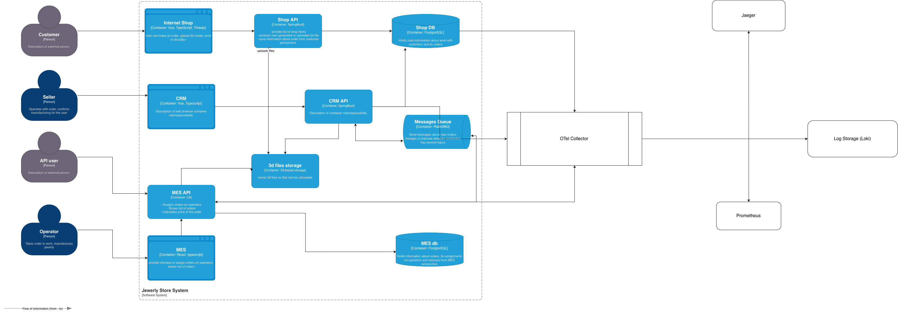

# Архитектурное решение по трейсингу

## 1. Мотивация

Симптомы проблемы:

* заказы "зависают" в неопределённом состоянии;
* появляются жалобы от партнёров о неполученных заказах;
* команды не видят полной цепочки прохождения заказа через системы (онлайн‑магазин > RabbitMQ > MES > CRM > оператор > доставка);
* есть подозрения, что сообщения теряются или многократно обрабатываются.

**Трейсинг необходим, потому что:**

1. **Бизнес‑видимость:** трейсинг даёт сквозное представление о жизненном цикле заказа и показывает, где именно он застопорился.
2. **Сокращение времени расследования инцидентов (MTTR):** инженеры быстрее находят корневую причину (message loss, slow worker, DB locks и т.д.).
3. **Повышение надёжности и сохранение контрактов:** быстрые ответы партнёрам и проактивное уведомление в случае задержек.
4. **Валидация изменений:** позволяет видеть влияние новых релизов/конфигураций на прохождение заказов.
5. **Предпосылка для автоматизации:** на основе трейсинга можно строить агрегированные метрики и правила алертинга (например, "заказ проводился > X минут в очереди").

**Ожидаемые технические и бизнес‑метрики, на которые повлияет трейсинг:**

* Время обнаружения дефекта/инцидента - уменьшится;
* Время решения дефекта/инцидента - уменьшится;
* процент потерянных/необработанных заказов - снизится;
* SLA выполнения расчётов (P95 времени расчёта) - улучшится;
* удовлетворённость партнеров (количество жалоб/контрактных потерь) - снизится.

---

## 2. Области покрытия трейсингом и возможные точки "поломки" заказа

### Компоненты, которые покрываем трейсингом (обязательные):

1. Онлайн‑магазин (frontend + backend) - входящие запросы и шаги создания заказа.
2. API Gateway / API для партнёров - входящие внешние запросы.
3. RabbitMQ - публикация/подписка сообщений, DLQ.
4. MES - API, воркеры расчёта стоимости, обработка jobs.
5. CRM - приём статусов и переходы заказа.
6. Сторонние интеграции (транспортные компании, платёжные шлюзы) - точки взаимодействия.
7. Базы данных (операции создания/обновления заказа) - важные транзакции.
8. S3/объектное хранилище (загрузка/доступ к 3D моделям).

### Места, где заказ может "сломаться" или зависнуть:

* при загрузке файла;
* frontend > backend (проблема с HTTP/timeout);
* при публикации сообщения в RabbitMQ;
* в очереди RabbitMQ;
* при передачи сообщения MES worker ;
* в процессе расчёта стоимости;
* при записи результата в БД;
* при уведомлении CRM;
* race conditio;
* при взаимодействии с внешними сервисами.

Мы должны покрыть трейсингом все вышеуказанные места, чтобы проследить путь заказа от создания до закрытия.

---

## 3. Данные, которые должны попадать в трейсинг

Для каждого спана/трейса собирать:

1. **Обязательные поля (всем сообщениям/спанам):**
   * `trace_id` - уникальный идентификатор трассы (при создании заказа создаётся новый trace_id);
   * `span_id`, `parent_span_id`;
   * `service_name` (shop-backend, shop-frontend, api-gateway, mes-worker, crm-service и т.д.);
   * `operation` / `span_name` (publish_to_queue, calculate_price, update_order_status и т.д.);
   * `start_timestamp`, `end_timestamp`, `duration_ms`;
   * `status` (OK/ERROR/UNKNOWN) и `error.message` при ошибке;
   * `order_id` - сквозной бизнес‑идентификатор заказа (обязательно для поиска);
   * `correlation_id` (если отличается от trace_id) - для интеграции с логами;
   * `environment` (dev/release/prod).
Большиноство полей создаются или при инициализации trace/span-а автоматически. 

2. **Контекстные поля (labels / attributes):**
    * `queue_name` и `message_routing_key` при публикации/консуме сообщений;
    * `retry_count` / `attempt`;
    * `polygon_count` / `model_complexity_bucket` - важны для анализа длительных расчётов;
    * `file_size` (если было upload);
    * `http.status_code`, `http.method`, `http.url` для HTTP‑запросов; > (Большинство библиотек собирают эти данные автоматически)
    * `db.query_signature` или `db.operation` при важных транзакциях (либо хеш запроса);
    * `dlq_reason` (если сообщение ушло в DLQ).

3**Дополнительные данные для логов и сопоставления:**

    * Полный correlation_id, trace_id и span_id в structured logs;
    * При ошибках - stacktrace/exception_type (усечённо, без PII);
    * business_event (INITIATED, FILE_UPLOADED, SUBMITTED, PRICE_CALCULATED и т.д.).

**Принципы сбора:**

* trace_id должен создаваться на входе (при SUBMITTED/принимающем API), затем проксироваться через все межсервисные вызовы и помещаться в заголовки RabbitMQ (например `traceparent`/`tracestate`);
* логирование и трейсинг должны быть связаны: каждый log entry должен содержать `trace_id` и `span_id`;

---

## 4. Предлагаемое решение (архитектура трейсинга)

### Технологии и компоненты (рекомендуемые)

* **OpenTelemetry (OTel)** - SDKs для Java (Spring Boot), .NET, JavaScript (frontend) - для генерации трасс и метрик.
* **OTel Collector** - централизованный агент/коллектор для агрегации трасс и метрик, фильтрации, семплинга и экспорта.
* **Tracing backend:** Jaeger(Насколько вижу более часто встречаемый вариант сервиса для трайсов/на его основе делают свои) .
* **Лог‑стек:** Loki / ELK (Elasticsearch) для структурированных логов, связанные с trace_id.
* **Metrics backend:** Prometheus + Alertmanager для метрик и алертов, Grafana для визуализации.
* **Инструменты интеграции RabbitMQ:** плагин/middleware для прокидывания W3C trace context в заголовки сообщений.
* **Correlation layer:** внедрить middleware/filters (существуют готовые библиотеки) в каждом сервисе, который выставляет/чтёт `traceparent` header и записывает service_name, instance_id.

### Компоненты, которые нужно внедрить/доразработать

1. **Instrumentation в приложениях:**
    * Spring Boot (shop + CRM): добавить OTel Java SDK + auto‑instrumentation (HTTP, JDBC).
    * MES (C#): добавить OpenTelemetry .NET SDK + manual spans для вычислительных задач.
    * Frontend (Vue/React): добавить OTel JS (trace user interactions, создания заказа) и передавать headers.
2. **RabbitMQ middleware:**
    * На публикации: attach traceparent header (формат W3C).
    * На потреблении: создать новый span с parent = trace_id из headers.
3. **OTel Collector:**
    * Развёртывается в кластере/отдельном инстансе; конфигурация экспорта в Tempo/Jaeger + Prometheus exporter.
4. **Tracing storage (Tempo/Jaeger) + Grafana:**
    * Для поиска трейсoв по `order_id` и визуализации.
5. **Логи (Loki/ELK):**
    * Структурированные логи с полями `trace_id` и `order_id`.
6. **UI/поиск трейсoв:**
    * Grafana + Trace search или Jaeger UI для удобной навигации по заказу.
7. **Инструменты аналитики:**
    * Pipeline для агрегирования trace‑данных в метрики (например, число заказов, зависших > X минут), отправка в Prometheus.

### Новые связи и компоненты на диаграмме
* **OTel Collector** как отдельный компонент, принимающий данные от всех сервисов (shop, crm, mes, rabbitmq exporters).
* **Tracing Backend (Jaeger)**.
* **Log Store (Loki)**.

**Диаграмма контейнеров (обновлённая) - файл:**

* 
* [img.png](img.png) - версия с новыми компонентами (OTel Collector, Jaeger, Prometheus, Loki).

---

## 5. Компромиссы и ограничения

1. **Стоимость хранения и обработки трасс:**
   * Полный трейсинг 100% всех заказов может стать дорогим (объём трасс и лонг‑тёрм сторэджа).
2. **Нагрузка на инфраструктуру:**
   * Коллектор и backend требуют ресурсов; при высокой нагрузке нужно масштабировать (что повышает стоимость).
3. **Чувствительные данные:**
   * Трассы могут содержать конфиденциальные данные. Требуется фильтрация и маскирование.

Решается: правильной конфигурацией и правильной работой с конфиденциальными данными.

---

## 6. Аспекты безопасности

1. **Доступ:**
    * Доступ к UI трейсинга (Grafana/Jaeger) - только через SSO (LDAP/OKTA) с RBAC.
    * Роли: Support, Dev, DevOps, Product; права предоставляются по принципу наименьших привилегий. Zero trust!

2. **Шифрование:**
   * TLS для передачи трасс и логов (OTel Collector ↔ backend), HTTPS для UI. 
3. **Защита данных:**
    * Маскирование в спан‑атрибутах и логах (email, phone и другие). Собранные атрибуты - order_id, partner_id, polygon_count и другие - безопасны.
4. **Сегментация окружений:**
    * Строгое разделение dev/release/prod и агрегация трасс по environment tag.
5. **Аудит:**
    * Вести аудит запросов к трейсинг‑UI (кто искал trace_id, когда и почему).
6. **Retention policy:**
    * Для продакшн: 90 дней для трейсов - с автоматическим удалением старых данных.
    * Для dev среды ограничить кол-во сохраняемых трейсов.